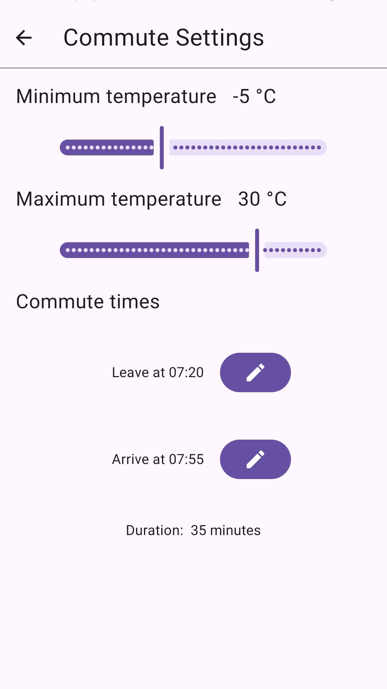
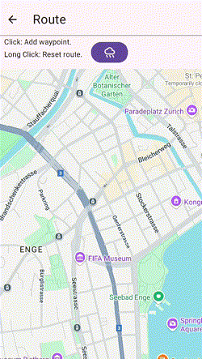
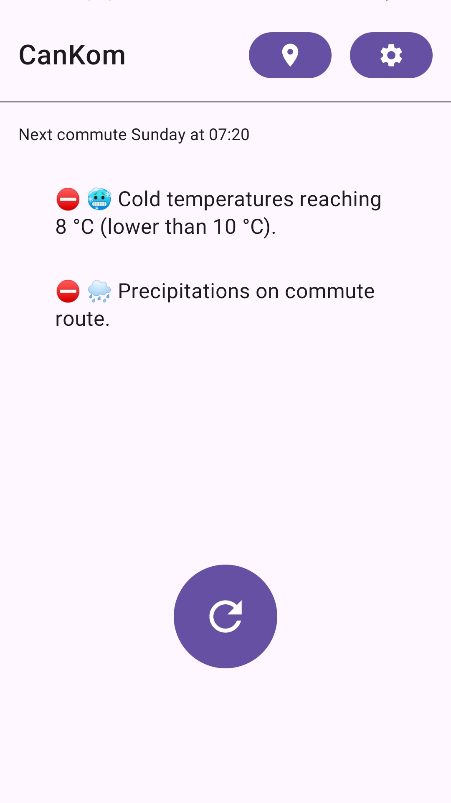
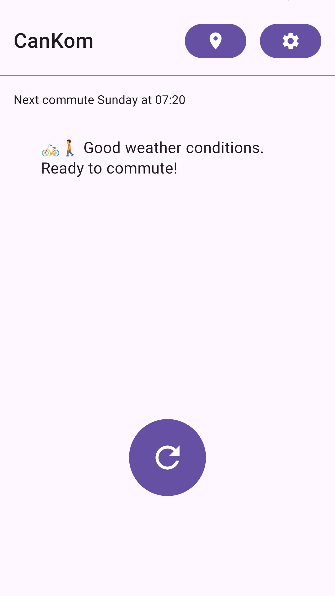
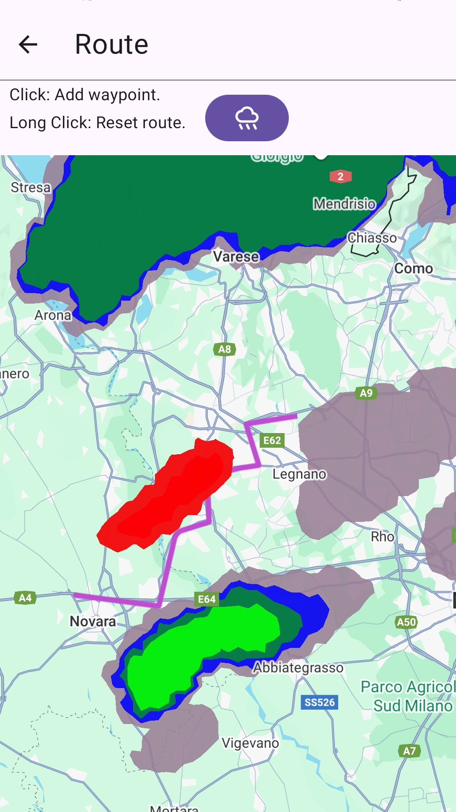
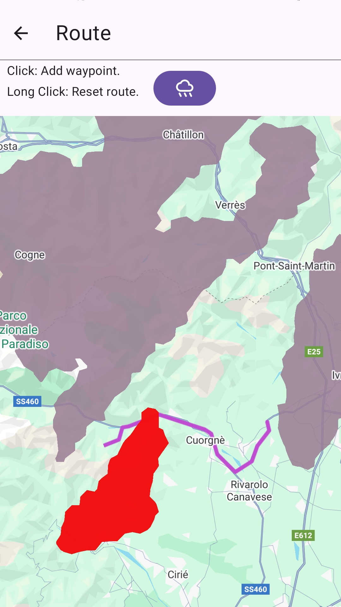

# CanKom 
 

*Can I commute?*
An Android utility app that tells if your next daily commute is affected by weather.

## Usage
(Only usable in Switzerland and border areas) 

Configure your daily commute route, leave/arrival times and a suitable temperature range.

 

Checks if your next commute will be affected by:
- Hot/Cold temperatures
- Precipitations

  

Precipitation checks are accurately carried out intersecting your route with weather forecast radar data maps.

 

## Setup
### Create Maps API Key

1. Follow instructions to generate a [Google Maps API key](https://developers.google.com/maps/documentation/embed/get-api-key#create-api-keys)
2. Create a `local.properties` file and write the following line with your API key:
```
API_KEY=<google maps API key>
```
### Build App
1. Download, install and setup [Android Studio](https://developer.android.com/sdk/index.html)
2. Clone this repository and open its root folder as project in Android Studio
3. Click on build button

## Legal

- Unless otherwise explicited in file comments, the whole project is under [MIT License](LICENSE).

- Http requests are sent to https://www.meteoswiss.admin.ch to retrieve meteorological forecast information. 
Users must abide to the legal basis of Meteo Swiss before attempting any use of the app or any derivative works. In no event shall the authors of the repository be liable for any potential infringiments caused by users to Meteo Swiss services.